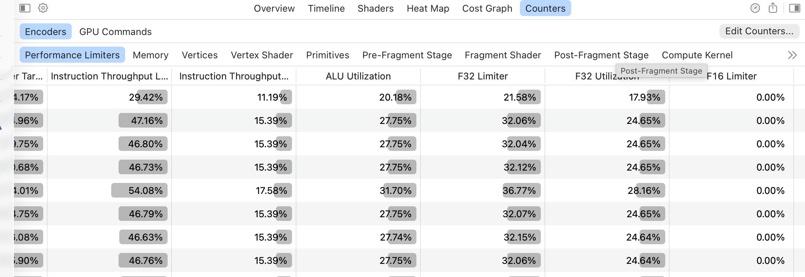
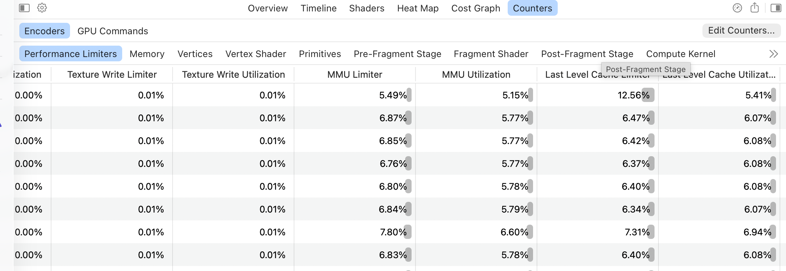
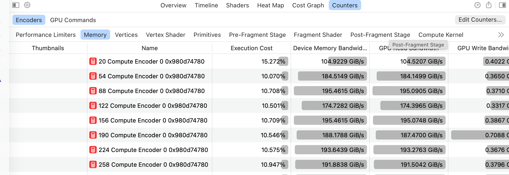
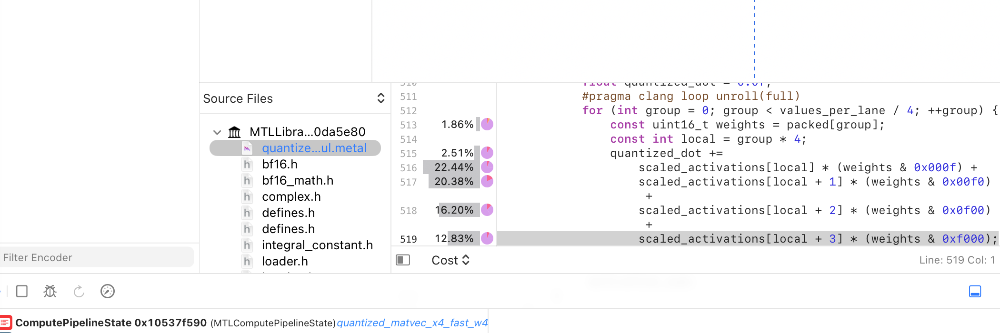

# 🚧 Appendix: Performance Evidence Ledger

> **Status: Experimental, single-machine evidence.** See the
> [Week 2 verification matrix](./week2-overview.md#verification-status) before
> treating a correctness, integration, or performance result as broader proof.

This appendix records the measurements that determined the course order. The
numbers are not additive promises: after one bottleneck shrinks, every other
operator becomes a larger fraction of model time.

## Benchmark Method

The progression runner launches every checkpoint in a fresh process,
alternates their order, performs complete-request warmups, synchronizes lazy
MLX work inside the timer, and reports the median:

```bash
pdm run bench-week2-progression --offline --repeats 4 --cooldown-seconds 1 \
  --model qwen3-4b --input-len 128 --output-len 129 --warmup 2 \
  --prefill-logits last --json-output week2-128.json

pdm run bench-serving-progression --offline --repeats 3 \
  --model qwen3-4b --num-seqs 16 --batch-size 4 \
  --min-input-len 128 --max-input-len 1024 \
  --min-output-len 32 --max-output-len 128 \
  --prefill-step 128 --json-output serving-qwen3-4b.json
```

`--prefill-logits last` is a generation-serving workload: both the reference
solution and MLX project only the last prompt row into vocabulary logits. Use
`--prefill-logits all` for prompt scoring, but never compare the two modes.
Decode throughput excludes the first generated token because that token is
produced by prefill.

MLX's published `mlx_lm.benchmark` table uses a 2,048-token prompt and 128
generated tokens. That makes 2K/128 a useful static-library comparison point,
not a paging acceptance test or a long-context proof. Use a context sweep:

| Point | Purpose |
|---:|---|
| 128 | fixed Week 2 acceptance and short interactive requests |
| 2,048 | standard MLX-style static stress comparison |
| 8,192 | long-context attention and KV-cache stress |
| 16,384 | stress point after the 8K path is healthy |

`llama-bench` commonly uses prompt-processing 512 and token-generation 128 by
default, which is another reminder that benchmark lengths are conventions, not
universal workloads. Always publish the exact prompt and output lengths.

The measured machine below is an Apple M4 Pro with a 20-core GPU and 64 GB of
memory. Static Week 2 rows use two complete warmups and the median of four
balanced fresh processes; the continuous-serving rows use one warmup and the
median of three fresh processes.

## Week 2 Checkpoint Retention Ledger

A polished explanation is not evidence that an optimization belongs in the
course. Before retaining a checkpoint, answer six questions: its invariant,
why it could be faster, where it wins, where it loses, its fallback, and how the
benchmark could mislead us. This ledger records the current answers; links
below contain the measurements.

| Checkpoint | Required invariant | Performance hypothesis | Retained range and losing shapes | Fallback or control | Main benchmark trap |
|---|---|---|---|---|---|
| Dense KV cache | Caller offset equals every layer cache length; K/V append on the sequence axis | Reuse projected prefix K/V instead of recomputing the full model prefix | Wins incremental decode as the prefix grows; repeated `concat` still copies `O(S²)` bytes | Week 1 full-prefix model remains the semantic control; Week 3 pages replace growth copies | Comparing cached MLX with an uncached course model measures different algorithms |
| Packed quantized matvec | W4, group size 128, BF16 parameters, contiguous packed layout, and the declared transpose convention | Read packed weights once and share unpack/scale work across SIMD lanes | Retained for `M <= 8`; multi-row prefill exposes poor reuse and motivates Day 6 | Vanilla W4 primitive is the operator oracle; named earlier checkpoints preserve the dense control | Lazy execution or timing post-materialized weights can hide weight traffic |
| RMSNorm | BF16 I/O with the sum of squares accumulated in FP32 | Fuse reduction, normalization, and weight multiply into one dispatch | Retained at Qwen hidden dimensions after both operator and decode gains; unknown dimensions require remeasurement | Readable RMSNorm and the Day 3 checkpoint remain selectable | Adding isolated microseconds as if checkpoint gains were independent |
| RoPE | One valid offset per batch row; even rotated dimension; tail values preserved | Fuse angle generation and pair rotation without intermediate graphs | Retained for Qwen decode rows; head-count and rotated-dimension changes require remeasurement | Readable RoPE and the RMSNorm-only checkpoint remain selectable | Benchmarking a cached or precomputed angle path against fresh angle construction |
| SwiGLU | Gate and up tensors have identical shape and dtype | Fuse SiLU and the gate/up product into one elementwise dispatch | Retained for Qwen MLP shapes; tiny tensors and other dtypes are not a performance claim | Readable SiLU-product and the RoPE checkpoint remain selectable | Accepting an operator win without a repeated complete-model gain |
| Decode attention | `Hq % Hkv == 0`, `D <= 256`, FP32 online-softmax state, and causal/explicit mask semantics | Avoid score/probability tensors and merge softmax while walking K/V | Model dispatch is `L <= 8`, `S <= 128`, and no explicit mask; it loses past the measured context crossover and is under-filled at very short contexts | Readable grouped attention handles longer queries, longer contexts, and explicit masks | Fixed implementation order, GPU performance-state drift, or treating correctness at `S=1` as schedule efficiency |
| SIMD-matrix prefill | W4/group-128 layout, BF16 storage, FP32 tile accumulation, and correct partial tiles | Reuse activation and dequantized-weight tiles across prompt rows | Performance-lab path for `M > 8`; partial and new model shapes need both correctness and timing sweeps | Day 3 matvec remains the short-row dispatch; vanilla matmul is the oracle | Comparing all-logit course prefill with last-logit MLX serving |
| Split-K prefill | Partitions align to quantization groups; partial planes are disjoint; final reduction is FP32 | Add independent groups only while the ordinary result grid is under-filled | Helps short narrow Qwen projections, is neutral around the 128-token acceptance shape, and loses once the base grid is occupied | `split_k <= 1` dispatches exactly to the Day 6 unsplit kernel | Profiling independent layers can hide under-occupancy that appears in the dependency-ordered model |

This is a retention ledger, not a portability certificate. A new GPU, MLX
release, model shape, dtype, or workload reopens the corresponding row.

## Long-Context Budget for Week 4

Context length has separate model, memory, and latency limits. For the course
Qwen3-4B checkpoint, one token of BF16 K/V state occupies

```text
36 layers * 2 (K and V) * 8 KV heads * 128 values * 2 bytes
    = 147,456 bytes = 144 KiB per token
```

The checkpoint declares `max_position_embeddings = 65,536`, but its
`rope_scaling` field is empty. Qwen documents that Qwen3 training covers
[32,768 tokens](https://github.com/QwenLM/Qwen3/blob/main/docs/source/deployment/vllm.md#context-length)
and recommends RoPE scaling for substantially longer inputs. The unmodified
course model therefore has a 32,768-token validated limit even though its
configuration permits a larger position experiment.

Memory is not the binding limit on the measured 64 GB M4 Pro. MLX reports a
51.84 GiB recommended GPU working set, and the quantized checkpoint occupies
1.99 GiB. Reserving 8 GiB for activations, allocator slack, and outputs gives

```text
floor((51.84 GiB - 1.99 GiB - 8 GiB) / 144 KiB) = 304,738 tokens
```

That estimate is a capacity calculation, not permission to exceed the model's
trained range. The course limit is the minimum of the limits:

```text
min(32,768 trained, 65,536 configured, 304,738 memory) = 32,768 tokens
```

Week 4 uses 32,768 total tokens as its hard context budget. It starts
compaction before the rendered input exceeds 24,576 tokens, reserving 8,192
tokens for the next model response and a large tool result. The tokenizer must
count the complete rendered request, including system instructions and tool
schemas.

### What Becomes Slow at 300K

FlashAttention removes the quadratic score-matrix allocation; it does not
remove the work. Full-attention prefill remains quadratic in context length,
so 300K contains about 84 times the attention work of 32K. One-token decode
must read a linearly growing K/V history at every layer.

The following synthetic operator sweep uses MLX 0.32.0, one Qwen3-4B-shaped
BF16 decode query, three fresh processes, and the median of fifteen synchronized
dispatches per process. The final column sums the isolated layer latency across
36 layers and is an optimistic attention-only ceiling; a complete model must
also run projections, normalization, sampling, and cache updates.

| Context | Full-model BF16 KV | MLX SDPA per layer | Attention-only decode ceiling |
|---:|---:|---:|---:|
| 2,048 | 0.28 GiB | 0.14 ms | 195.33 tok/s |
| 8,192 | 1.12 GiB | 0.29 ms | 96.72 tok/s |
| 32,768 | 4.50 GiB | 0.92 ms | 30.28 tok/s |
| 65,536 | 9.00 GiB | 1.73 ms | 16.08 tok/s |
| 131,072 | 18.00 GiB | 3.65 ms | 7.61 tok/s |
| 300,000 | 41.20 GiB | 9.49 ms | 2.93 tok/s |

The 300K operator allocation runs on this M4 Pro, but an end-to-end 300K run of
the course checkpoint would be outside its configured and training ranges,
would leave little working-set headroom, and would make initial prefill
impractical. It is useful as a kernel stress test, not as a supported course
context.

MLX contains several long-context optimizations. Its fused GQA decode path
automatically switches to a context-partitioned two-pass reduction; the
[0.30.4 release](https://github.com/ml-explore/mlx/releases/tag/v0.30.4)
specifically calls out faster long-context vector GQA. Multi-token attention
uses a tiled fused path, and MLX-LM chunks prompt evaluation to bound temporary
activations. MLX-LM also offers prompt-prefix reuse, a rotating fixed-size
cache, and quantized KV storage. Prefix reuse helps repeated prompts; cache
rotation changes full-attention semantics; and KV quantization trades numerical
precision and sometimes speed for capacity. None makes the first full 300K
prefill linear-time.

Reproduce the operator sweep with:

```bash
pdm run bench-long-context-attention \
  --json-output benchmark_results/m4-pro-qwen3-4b-long-context-mlx-0.32.0.json
```

## Dependency Upgrade

The project upgraded from MLX 0.29.1 to 0.32.0 and from the mlx-lm 0.28 series
to 0.31.3. A matched Qwen3-4B run showed:

| Context | Metric | MLX 0.29.1 | MLX 0.32.0 | Change |
|---:|---|---:|---:|---:|
| 128 | Prefill tok/s | 825.48 | 828.34 | +0.35% |
| 128 | Decode tok/s | 88.32 | 88.08 | -0.27% |
| 2,048 | Prefill tok/s | 816.73 | 820.85 | +0.50% |
| 2,048 | Decode tok/s | 78.42 | 74.81 | -4.60% |

The small differences show why the comparison must record exact dependency
versions: the MLX denominator is part of the experiment, even when an upgrade
does not materially change the result.

## Week 2 Performance by Chapter

Week 2 has one fixed acceptance shape: Qwen3-4B, a 128-token prompt, 128 timed
decode steps, last-row logits, two complete warmups, and the median of four
fresh processes. Two passes use forward checkpoint order and two use reverse
order. The output length is 129 because prefill produces the first generated
token.

Each row is cumulative. Day 2 deliberately retains the Day 1 checkpoint while
it establishes the synchronized benchmark and profile that choose Day 3.

| Chapter | Cumulative checkpoint | Prefill tok/s | Decode tok/s | Output tok/s | Change selected by the preceding profile |
|---|---|---:|---:|---:|---|
| Day 1 | Dense request KV cache | 730.43 | 24.63 | 24.01 | Stop full-prefix decode recomputation. |
| Day 2 | Benchmark and profile | 730.43 | 24.63 | 24.01 | Measure packed projection weight traffic. |
| Day 3 | Quantized matvec | 105.00 | 58.71 | 37.95 | Keep weights packed and add the x4 decode kernel. |
| Day 4 | Fused model kernels | 105.97 | 75.21 | 44.33 | Remove the newly exposed pointwise graph launches. |
| Day 5 | Fused decode attention | 105.99 | 75.75 | 44.50 | Replace the next measured context-dependent gap. |
| Day 6 | SIMD-matrix prefill | 797.45 | 75.12 | 69.17 | Fix the quantized matrix path exposed by Day 3. |
| Day 7 | Split-K prefill | 792.55 | 75.41 | 69.37 | Fill the GPU only for under-occupied short projections. |
| Baseline | MLX 0.32.0 | 830.49 | 89.37 | 81.30 | External denominator. |

### The Kernel Profile That Selects Each Chapter

The reference-solution profile does not replace an operator with an MLX
operator. It calls the projection, attention, pointwise, and cache paths from
`tiny_llm_ref` at Qwen3-4B shapes and replays each group at the model's real
dispatch count. The projection replay preserves the transformer dependency
order so work from a later MLP cannot hide an under-filled attention
projection. Each round rotates the category order, synchronizes every category
once, and the median follows four warmups and twelve samples:

```bash
pdm run profile-week2-kernels --solution tiny_llm_ref --model qwen3-4b \
  --warmup 4 --iterations 12 \
  --json-output week2-kernel-profile.json
```

The bar widths below are normalized within a checkpoint. The time at the right
is the sum of the synchronized category medians, not a throughput measurement.
Forcing category boundaries prevents some whole-graph fusion, so use the shares
to rank work and the fresh-process checkpoint table above to accept or reject a
change.


This is an operator-attribution chart, not a Metal flame graph. It ranks model
operator families and selects the next kernel to inspect. The Shader Cost Graph
described in [GPU Profile and CLI Tools](#gpu-profile-and-cli-tools) answers the
next question: which function and source line inside that kernel is costly.

The profile makes the progression concrete:

- Cached decode spends 81.5% of attributed time in dense projections. Day 3
  therefore changes weight storage and the decode projection schedule first.
- After packed matvec, the pointwise group is 35.8% while attention is only
  4.5% at the 128-token acceptance context. Day 4 therefore removes the
  measured normalization, position, and activation overhead first.
- After the Day 4 pointwise kernels, attention rises to 6.4% and is the next
  context-dependent gap. Day 5 tests online softmax and retains it only after
  the complete-model benchmark also improves.
- After Day 5, decode reaches 84.8% of MLX. Changing the workload to
  128-token prefill makes the readable quantized projection path 99.0% of
  attributed time, which selects the cooperative matrix kernel in Day 6.
- After Day 6, projections remain most of the inherent prefill work, but the
  long-shape operator comparison is already close to MLX. The 32-token shape
  sweep then isolates under-occupied Qwen projections and selects Split-K only
  below their measured crossover.

The checked-in raw profile is
`benchmark_results/m4-pro-qwen3-4b-week2-kernel-profile-mlx-0.32.0.json`.
The balanced fresh-process samples are
`benchmark_results/m4-pro-qwen3-4b-week2-progression-mlx-0.32.0.json`.

The operator tables below use `bench-week2-operators` with twelve warmup rounds
and sixty measured rounds. Each round synchronizes every implementation, and
the runner rotates through every execution order so GPU performance-state drift
does not consistently favor readable code, the course kernel, or MLX. These
latencies are microbenchmarks; only the fresh-process table above accepts an
end-to-end checkpoint.

### Day 1: Cache the Prefix

The dense cache makes prefill a one-time cost, but every decode projection
still reads dense weights. Day 1 therefore starts with respectable prefill and
only 24.63 decode tok/s. The result gives Day 2 a real cached baseline to
profile.

### Day 2: Measure Before Optimizing

Day 2 changes the measurement discipline rather than the model. The end-to-end
row and synchronized attribution answer different parts of the handoff:

| Evidence | Result | Decision |
|---|---:|---|
| Complete-model decode | 24.63 tok/s; MLX 89.37 tok/s | A large decode gap remains. |
| Dense projections | 33.66 ms, 81.5% of attributed time | Optimize projection weight traffic first. |
| Pointwise operators | 6.45 ms, 15.6% | Defer until projections shrink. |
| Attention | 0.85 ms, 2.1% | Do not select attention from this workload. |
| KV growth | 0.33 ms, 0.8% | The dense cache already removed prefix recomputation. |

The operator-family result is sufficient to select Day 3. A source-enabled GPU
trace becomes useful after the projection is a course-owned shader; the Day 3
analysis attaches that kernel-internal evidence.

### Day 3: Keep Weights Packed

The x4 W4A16 matvec raises complete-model decode from 24.63 to 58.71 tok/s, a
138.4% gain. Prefill falls from 730.43 to 105.00 tok/s because matrix-shaped
inputs still use the readable quantized kernel. The operator microbenchmark
checks whether the decode gain came from the intended projection schedule:

| Qwen3-4B projection, `M=1` | Readable | Packed matvec | MLX |
|---|---:|---:|---:|
| Q | 750.3 us | 187.6 us | 183.4 us |
| K | 239.5 us | 145.1 us | 147.8 us |
| V | 244.8 us | 147.0 us | 138.9 us |
| O | 590.3 us | 163.7 us | 160.2 us |
| MLP gate | 908.8 us | 182.5 us | 177.2 us |
| MLP up | 948.0 us | 185.6 us | 182.9 us |
| MLP down | 1,243.3 us | 188.3 us | 181.6 us |
| Vocabulary head | 11,086.1 us | 1,030.2 us | 1,029.3 us |

The packed operator is close to MLX at every listed shape. Projections still
occupy 57.9% of the synchronized model replay because every layer inherently
uses them, but normalization, position, and activation now occupy 35.8% and are
the larger removable gap. That combination, rather than the absolute height of
the projection bar, selects Day 4.

The [source-enabled matvec profile](#m4-pro-decode-matvec-pipeline-profile) is
the kernel-internal attachment for this checkpoint. It reports a 35.22 us
steady-state GPU dispatch, 5.33 MiB read per dispatch, and 71.85% of shader cost
on four masked W4 products. Those hot lines identify optional matvec tuning,
but the matched operator table shows why that work does not displace the larger
pointwise model gap in the required course order.

### Day 4: Fused Model Kernels

The cumulative model and operator results agree on all three retained changes:

| Checkpoint | Decode tok/s | Readable operator | Fused operator | MLX operator |
|---|---:|---:|---:|---:|
| Day 3 packed matvec | 58.71 | -- | -- | -- |
| Fast RMSNorm | 65.94 | 210.0 us | 168.2 us | 147.1 us |
| Fast RoPE | 71.16 | 180.9 us | 144.8 us | 118.7 us |
| Fused SwiGLU | 75.21 | 189.4 us | 125.7 us | 137.2 us |

The pointwise group falls from 35.8% after Day 3 to 10.5%. Projections are now
80.5% of attributed decode time but are already close to their MLX operator
latencies. Attention is 6.4% at the acceptance context and grows with context,
which makes it the next shape-dependent operator to test. No source trace is
needed for this handoff because the three microbenchmarks, cumulative model
rows, and updated attribution agree.

### Day 5: Fused Decode Attention

At the 128-token acceptance context, fused attention raises complete-model
decode from 75.21 to 75.75 tok/s. The model-equivalent microbenchmark includes
the FP32 promotion and output cast used by the readable fallback:

| Cached context | Readable | Fused | MLX | Fused vs readable |
|---:|---:|---:|---:|---:|
| 32 | 129.2 us | 111.3 us | 96.5 us | 1.16x faster |
| 128 | 182.6 us | 166.8 us | 147.4 us | 1.09x faster |
| 160 | 229.6 us | 237.9 us | 163.5 us | 3.6% slower |
| 192 | 229.2 us | 240.9 us | 160.1 us | 5.1% slower |
| 256 | 241.4 us | 265.1 us | 154.8 us | 9.8% slower |

The measured crossover narrows the reference dispatch guard to contexts of at
most 128 tokens. Larger contexts retain the readable path. This is why both
operator latency and the complete-model result belong in the analysis: the
model accepts the optimization, while the shape sweep defines where it is
valid.

The completed decode checkpoint reaches 84.8% of MLX. Switching the profile to
128-token prefill attributes 1,196.34 ms of 1,208.78 ms, or 99.0%, to
quantized projections; attention accounts for 6.08 ms and the pointwise group
for 6.35 ms. That new workload selects the matrix-shaped projection kernel in
Day 6 without requiring another attention trace.

### Day 6: Use Cooperative Loads for Quantized Prefill

At the Day 5 prefill checkpoint, quantized projections account for 1,196.34 ms
of the 1,208.78 ms attributed profile, or 99.0%. The cooperative matrix
schedule reduces attributed projection time to 147.63 ms and raises
complete-model prefill from 105.99 to 797.45 tok/s. MLX reaches 830.49 tok/s.

The long-row controls show that the tile arithmetic and cooperative loads are
healthy once the result grid is occupied:

| Projection at `M=2048` | Day 6 | MLX |
|---|---:|---:|
| Q, `2560 -> 4096` | 6.64 ms | 6.65 ms |
| K, `2560 -> 1024` | 1.78 ms | 1.79 ms |
| O, `4096 -> 2560` | 6.82 ms | 6.66 ms |
| MLP gate, `2560 -> 9728` | 15.65 ms | 15.75 ms |
| MLP down, `9728 -> 2560` | 16.25 ms | 15.90 ms |

At the 128-token acceptance shape, the same projections are within 3.1% of
MLX. The short-row control exposes a different pattern:

| Projection at `M=32` | Day 6 SIMD | MLX | Gap |
|---|---:|---:|---:|
| Q | 733.0 us | 643.9 us | 13.8% |
| K | 221.0 us | 205.1 us | 7.8% |
| O | 256.3 us | 241.4 us | 6.2% |
| MLP gate | 410.0 us | 406.6 us | 0.8% |
| MLP down | 440.1 us | 391.7 us | 12.4% |

The operator gaps correlate with result-grid size rather than reduction width
or arithmetic. For the narrow K projection, the unsplit launch geometry is:

| Prompt rows | Row tiles | Output tiles | Independent threadgroups |
|---:|---:|---:|---:|
| 32 | 1 | 32 | 32 |
| 128 | 4 | 32 | 128 |
| 2,048 | 64 | 32 | 2,048 |

The source-enabled capture command at the end of Day 6 records the first row of
this table. In Xcode, the encoder must show the unsplit SIMD-matrix pipeline,
`32 x 1 x 1` threadgroups, and 128 threads per threadgroup before the trace is
accepted as occupancy evidence. The long controls rule out a generally slow
tile, while the short operator table and dispatch geometry select Split-K for
Day 7.

### Day 7: Split K Only Below the Crossover

The per-projection microbenchmark tests the proposed occupancy fix directly at
`M=32`:

| Projection | Day 6 SIMD | Split-K | MLX | Split-K effect |
|---|---:|---:|---:|---:|
| Q | 733.0 us | 612.3 us | 643.9 us | 1.20x faster |
| K | 221.0 us | 201.3 us | 205.1 us | 1.10x faster |
| O | 256.3 us | 243.8 us | 241.4 us | 1.05x faster |
| MLP gate | 410.0 us | 414.2 us | 406.6 us | Falls back; within noise |
| MLP down | 440.1 us | 395.1 us | 391.7 us | 1.11x faster |

The complete 32-token model confirms that the useful projection changes survive
composition:

| Checkpoint | Prefill tok/s | Decode tok/s | Prefill / MLX |
|---|---:|---:|---:|
| Day 6 cooperative matmul | 607.36 | 83.53 | 82.3% |
| Day 7 split-K | 679.50 | 83.53 | 92.1% |
| MLX 0.32.0 | 737.55 | 90.52 | 100% |

Split-K adds 11.9% complete-model prefill at this short shape. At `M=128`, the
operator sweep is neutral: Q, O, gate, and down dispatch unchanged, while the
narrow K split measures 221.2 us versus 222.8 us unsplit. The fresh-process
acceptance result is likewise neutral at 792.55 versus 797.45 prefill tok/s. At
`M=2048`, every projection falls back exactly to Day 6. Because the dispatch
geometry, operator table, and end-to-end result agree, another Xcode trace would
not change the retention decision.

The fresh-process samples for the short control point are checked in at
`benchmark_results/m4-pro-qwen3-4b-week2-32-mlx-0.32.0.json`. The completed
Week 2 path reaches 95.4% of MLX prefill, 84.4% of MLX decode, and 85.3% of MLX
end-to-end output throughput at the 128-token acceptance shape. All three
exceed the 80% course target. Longer static sweeps remain attention diagnostics;
they do not test the memory-management reasons for paging.

## Week 3 Performance by Chapter

Paging adds indirect K/V reads and is not expected to beat contiguous
attention for one preallocated static request. Week 3 therefore measures a
serving workload with request turnover, incremental unknown-size growth,
chunked admission, dense batch reconstruction, and page reuse:

```bash
pdm run bench-serving-progression --offline --repeats 3 \
  --model qwen3-4b --num-seqs 16 --batch-size 4 \
  --min-input-len 128 --max-input-len 1024 \
  --min-output-len 32 --max-output-len 128 \
  --prefill-step 128 --warmup 1 \
  --json-output serving-qwen3-4b.json
```

A complete warmup compiles the kernels. The runner then synchronizes and resets
every page pool, so the measured paged run starts with zero pages and zero
backing capacity.

| Chapter | Measured checkpoint | Primary result | Change from the preceding comparable path |
|---|---|---|---|
| Day 1 | Continuous scheduler | Defines request turnover and active-batch throughput. | Establishes the serving workload. |
| Day 2 | Chunked admission with dense reconstruction | 653.24 prefill; 32.77 output; 53.99 decode tok/s | Establishes the dense serving baseline. |
| Day 3 | Paged storage with compatibility gather | 662.69 prefill; 38.38 output; 71.02 decode tok/s | +17.1% output; +31.5% decode; -50.6% copy volume. |
| Day 4 | Direct paged decode schedule | 100.35 aggregate decode tok/s | +41.3% decode over the compatibility gather path. |
| Day 5 | Complete direct paged path | 650.10 prefill; 45.05 output; 100.35 decode tok/s | +37.4% output and request throughput over dense serving. |

Day 1 introduces scheduling, not a kernel speedup. Day 2 makes the hidden cost
measurable: appending one token still reconstructs a padded dense batch. Day 3
makes pages canonical but retains `gather_dense()` as a compatibility
checkpoint. Days 4 and 5 then remove that compatibility movement for decode
and long-query prefill respectively.

Days 4 and 5 share the final direct-paged process: queries with `L <= 8`
dispatch to the Day 4 decode schedule, while longer chunks dispatch to the Day
5 tiled schedule. The phase timers report their decode and prefill throughput
inside the same request trace; they are not results from different workloads.

Every headline number above comes from the same continuous-batch campaign. The
cumulative serving endpoints are:

| Storage and attention path | Prefill tok/s | Output tok/s | Decode tok/s | Requests/s | Peak KV MiB | Avoidable KV copy MiB |
|---|---:|---:|---:|---:|---:|---:|
| Dense growth and reconstruction | 653.24 | 32.77 | 53.99 | 0.437 | 1,096 | 209,532 |
| Paged storage plus dense gather | 662.69 | 38.38 | 71.02 | 0.511 | — | 103,445 |
| Direct paged attention | 650.10 | 45.05 | 100.35 | 0.600 | 576 | 504 |

The compatibility row omits peak storage because an exact peak must include
both the page pool and temporary dense staging allocation. Its other counters
remain directly comparable.

Direct paged attention improves output and request throughput by 37.4%,
aggregate decode by 85.9%, and peak KV storage by 47.4% relative to dense
serving. Avoidable logical copy volume falls by 99.8%. Relative to paged
storage plus gather, the direct operator adds 17.4% output throughput, 41.3%
decode throughput, and removes 99.5% of the remaining copy volume. Prefill is
0.5% below dense and 1.9% below gather at the 128-token serving chunk, so the
chapter does not claim a short-chunk FlashAttention speedup.

The 8K static run remains a secondary kernel diagnostic, not a Week 3 headline
or acceptance result. At that shape, paged FlashAttention raises prefill from
384.88 to 427.01 tok/s. MLX reaches 568.74 tok/s, so the page-aware path in the
reference solution reaches 75.1%. This explains where query tiling begins to
help without mixing a static denominator into the serving progression.
One-token decode continues to dispatch to the Day 4 vector schedule.

The checked-in result
`benchmark_results/m4-pro-qwen3-4b-mlx-0.32.0.json` contains the published
acceptance and direct-serving samples, medians, configurations, and host
metadata. Chapter checkpoint rows use the same fresh-process runner and
hardware.

Copy counters report logical operation volume, not hardware DRAM traffic.
Dense volume includes old K/V copied during each request-cache growth and live
K/V copied into a newly padded batch tensor at every decode step. Paged volume
includes old physical pages copied only when a layer's geometric pool grows.
Appending a token writes only its page slice, and later requests reuse freed
pages.

The direct-paged median reaches 1,116 live pages out of 1,152 reserved pages,
reuses 2,196 page allocations, and records 15,840 unused tail slots across
layer caches. It grows the layer pools 144 times because the measured run
starts empty. These counters make reuse and fragmentation visible; static
single-request latency cannot.

The workload validates continuous batching, chunked prefill, incremental
growth, and page reuse. Prefix sharing and speculative decoding require
separate traces with shared prefixes or cache rewind events and are not claimed
by this result.

## GPU Profile and CLI Tools

Two profiles are useful at different levels. The synchronized
reference-solution attribution ranks operator families without a GUI:

```bash
pdm run profile-week2-kernels --solution tiny_llm_ref --model qwen3-4b \
  --warmup 4 --iterations 12
```

After it selects an operator family, capture one source-enabled shader at the
same Qwen3-4B shape:

```bash
CMAKE_ARGS="-DMLX_METAL_DEBUG=ON" pdm run build-ext-ref

MTL_CAPTURE_ENABLED=1 pdm run capture-week2-shader \
  --solution tiny_llm_ref \
  --projection q --rows 1 \
  --iterations 10 \
  --output /tmp/week2-q-projection.gputrace
```

Open the trace in Xcode and profile the selected compute pipeline. Pipeline
Statistics reports shader GPU time together with instruction, ALU, cache, MMU,
control-flow, register, and spill evidence. On M3 and newer Macs, the Shader
Cost Graph is a true function-call flame graph with weighted source lines. The
checked-in chart above does not substitute for either view.

`xcrun xctrace` is available from the command line:

```bash
xcrun xctrace list templates

xcrun xctrace record \
  --template "Metal System Trace" \
  --output /tmp/tiny-llm-decode.trace \
  --launch -- pdm run bench --solution tiny_llm_ref --loader week3 \
    --model qwen3-4b --num-seqs 1 \
    --min-input-len 2048 --max-input-len 2048 \
    --min-output-len 33 --max-output-len 33 --warmup 1 \
    --prefill-logits last

xcrun xctrace export --input /tmp/tiny-llm-decode.trace --toc
```

On the measured M4 Pro, the CLI system trace resolves the exact
reference-solution pipelines, including
`quantized_matvec_x4_fast_w4a16_g128_bf16`,
`week2_decode_attention_bf16`, `week2_rms_norm_bf16`,
`week2_swiglu_bf16`, and `week2_rope_bf16`. Its exported shader-sample and
counter tables contain no rows on this configuration, so it identifies
functions but cannot establish an ALU or memory limiter. The source-enabled
`.gputrace` replay below supplies that evidence. Never infer a limiter from an
empty counter table, and do not use trace wall time as a throughput result.

### M4 Pro Decode-Matvec Pipeline Profile

This capture uses an Apple M4 Pro with a 20-core GPU, macOS 26.5.2, Xcode 26.6,
MLX 0.32.0, and the Qwen3-4B query projection at `M=1`, `K=2560`, `N=4096`.
Ten requested evaluations produced nine compute dispatches and one final
synchronization-only command buffer. Xcode measured 331.58 us of GPU time, or
36.84 us per recorded dispatch; the median after excluding the first dispatch
was 35.22 us. The Performance State was Medium, so these timings describe the
profile replay rather than an acceptance benchmark.

The trace occupies 161 MiB because it snapshots buffers, the debug metallib,
and source line tables. Size alone is not validation: the replay was accepted
only after Xcode showed the exact target pipeline, nine compute encoders, nine
dispatch calls, nonzero GPU time, and populated counter rows.

The Shaders view attributes 100% of captured shader cost to
`quantized_matvec_x4_fast_w4a16_g128_bf16`. Xcode reports 91 allocated
registers, a high-water mark of 91, and zero spilled bytes. The following
medians exclude the first dispatch. Xcode's limiter values are comparable
scores within the same replay, not percentages of wall time.

| Pipeline statistic | Steady-state median |
|---|---:|
| Occupancy manager target | 55.99% |
| Instruction-throughput limiter | 46.78% |
| Integer-and-complex limiter | 45.44% |
| F32 limiter | 32.07% |
| ALU utilization | 27.75% |
| MMU limiter | 6.84% |
| Last-level-cache limiter | 6.40% |
| Control-flow limiter | 3.94% |





The limiter scores alone do not mean that weight traffic is free. The same
steady-state dispatches report the following memory behavior:

| Memory statistic | Steady-state median |
|---|---:|
| Device-memory bandwidth | 191.59 GiB/s |
| Bytes read from device memory | 5.33 MiB/dispatch |
| Last-level-cache bandwidth | 201.64 GiB/s |
| Last-level-cache miss rate | 95.2% |



The projection is still a streaming kernel: almost every packed weight byte
comes from device memory, and the high cache miss rate is expected because each
output row is consumed once. Quantization has already reduced that unavoidable
traffic. At this schedule, however, the instruction and arithmetic limiter
scores are about seven times the MMU and last-level-cache limiter scores, while
the source-cost graph places most of the work on masked products rather than
the load. The profile therefore identifies arithmetic and code generation as
the incremental headroom above a substantial bandwidth floor.

The Shader Cost Graph locates the cost more precisely:

| Metal source | Shader cost |
|---|---:|
| Line 516, first masked weight product | 22.44% |
| Line 517, second masked weight product | 20.38% |
| Line 518, third masked weight product | 16.20% |
| Line 519, fourth masked weight product | 12.83% |
| **Four-line masked dot product** | **71.85%** |



This makes the next experiment narrow. Keep the packed W4A16 layout and the
four-output, two-SIMD-group schedule, but reduce instruction and register
pressure inside the masked dot product. One small candidate is an eight-value
staged variant that shortens the lifetime of the 16-element activation array;
another is a `float4` dot formulation that lets the compiler schedule the four
masked products together. Re-profile allocated registers, the four source
lines, isolated projection time, and full-model decode after each variant, and
drop the change unless all relevant measurements improve.

This is an optional follow-up, not another required Week 2 chapter. MLX's
[`qmv_fast_impl`](https://github.com/ml-explore/mlx/blob/v0.32.0/mlx/backend/metal/kernels/quantized.h)
uses the same affine rearrangement and four-output, two-SIMD-group structure,
so restating that formula is not a new optimization. The profile selects a
compiler-scheduling experiment; it does not claim that the experiment has
already won.

## Optimization Map

| Measured bottleneck | Retained change | Chapter |
|---|---|---|
| Full-prefix decode recomputation | Dense request KV cache | Week 2 Day 1 |
| Quantized projection weight traffic | Packed W4A16 x4 SIMD matvec | Week 2 Day 3 |
| Repeated small graph dispatches | RMSNorm, RoPE, SwiGLU kernels | Week 2 Day 4 |
| Growing short-context attention | Online-softmax decode kernel | Week 2 Day 5 |
| Scalar/strided prefill projection loads | Cooperative 32×32×32 quantized matmul | Week 2 Day 6 |
| Under-filled short-prefill result grid | Measured split-K dispatch | Week 2 Day 7 |
| Functional whole-cache page updates | Aliasing page-slice write primitive | Week 3 Day 3 |
| Scalar paged final reduction | Compact D=128 SIMD reduction | Week 3 Day 4 |
| Scalar contiguous-page K/V tile loads | Cooperative paged FlashAttention loads | Week 3 Day 5 |

This is the course progression: optimize one measured cost, benchmark and
profile again, then let the new profile choose the next chapter.

{{#include copyright.md}}
